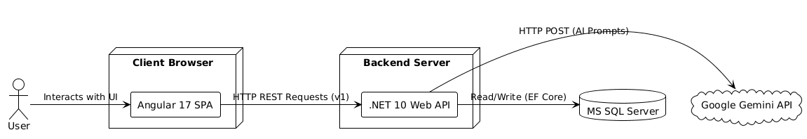
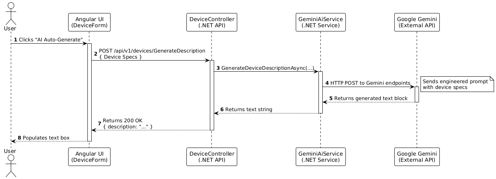
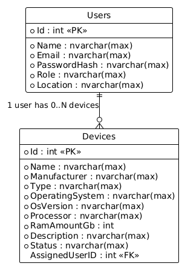
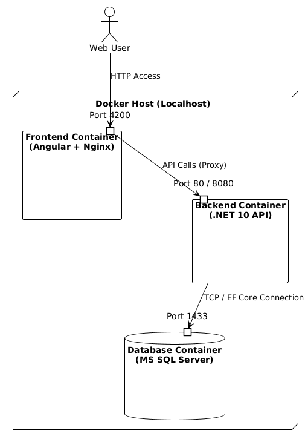

# Device Management System

A full-stack enterprise device management application built for the Graduate Software Engineer assessment. This system tracks company-owned mobile devices, their technical specifications, and their current assigned users.

---

## 📦 Deployment Guide

### ⚙️ Prerequisites

Make sure you have the following installed:

- [Docker Desktop](https://www.docker.com/products/docker-desktop/)
- [Git](https://git-scm.com/)

### 🚀 How to Deploy

1. **Clone the repository**
	```bash
	git clone https://github.com/Jorj2k3/Device-Management.git
	cd Device-Management
	```
2. **Configure the AI API Key**
	- Obtain a Google Gemini API Key.
	- Open `Backend/DeviceManagement.Api/DeviceManagement.Api/appsettings.json` and paste your Gemini API Key into the appropriate field.
3. **Build and run the containers**
	```bash
	docker compose up -d --build
	```
4. **Access the Application**
	- Frontend UI: [http://localhost:4200](http://localhost:4200) (or whichever port is exposed in docker-compose)

### 🔐 Test Credentials
The database is automatically seeded with dummy data upon creation. You can use the following credentials to test the application:

Admin User (Full Access: Create, Update, Delete Devices)

Email: [Insert Admin Email Here, e.g., admin@company.com]

Password: [Insert Password Here, e.g., DummyHash123!]

Standard User (Limited Access: View and Assign/Unassign Devices)

Email: [Insert Employee Email Here, e.g., bob@company.com]

Password: [Insert Password Here, e.g., DummyHash123!]

Alternatively, you can use the Register page to create a brand new standard employee account.

## 🛑 Stopping the Application
To gracefully stop the application and database, run:
```bash
docker compose down
```

---

## 🧑‍💻 Technical Overview

### 🚀 Features & Completed Phases

This project successfully implements all required phases, the bonus phase, and an extra architectural enhancement:

- **Phase 1 (Backend & DB):** Robust .NET 10 Web API using Entity Framework Core and SQL Server. Includes idempotent SQL scripts for database creation and seeding.
- **Phase 2 (Angular UI):** A modern, responsive Single Page Application (SPA) built with Angular 17+ and Bootstrap 5.
- **Phase 3 (Authentication & Authorization):** Secure role-based access control (Admin vs. Employee) using JWT (JSON Web Tokens) and BCrypt password hashing.
- **Phase 4 (AI Integration):** Automated, human-readable device description generation powered by the Google Gemini Large Language Model (LLM).
- **⭐ Bonus Phase (Advanced Search):** Custom, case-insensitive free-text search with a deterministic relevance ranking algorithm (scoring matches across Name, Manufacturer, Processor, and RAM).
- **✨ Extra Polish:** API Versioning (`v1`) implemented on the backend to ensure future mobile/web client backward compatibility.

### 🛠️ Tech Stack

**Frontend Layer**
- **Framework:** Angular 17 (Standalone Components)
- **Language:** TypeScript
- **Styling:** SCSS, Bootstrap 5, Bootstrap Icons
- **State/Async:** RxJS

**Backend Layer**
- **Framework:** ASP.NET Core Web API (.NET 10)
- **Language:** C#
- **Security:** JWT Authentication, BCrypt.Net
- **Documentation:** Swagger/OpenAPI

**Data & Infrastructure Layer**
- **Database:** Microsoft SQL Server (MS SQL)
- **ORM:** Entity Framework Core
- **Containerization:** Docker & Docker Compose
- **External Services:** Google Gemini API (AI)

---

### 🗂️ System Architecture
*(This diagram illustrates the separation of concerns between the browser-based client, the RESTful API, the SQL database, and the external Gemini service.)*



---

### 🔄 Sequence Diagram (AI Description Generation)
*(This diagram maps the chronological HTTP request cycle when a user triggers the automated LLM hardware summary.)*



---

### 🗃️ Entity Relationship Diagram
*(The relational schema demonstrating the one-to-many relationship mapping between Users and their assigned Devices.)*



---

### 🌐 Deployment Diagram
*(An overview of the Dockerized infrastructure, showing how traffic is proxied through the exposed ports into the isolated frontend, backend, and database containers.)*

